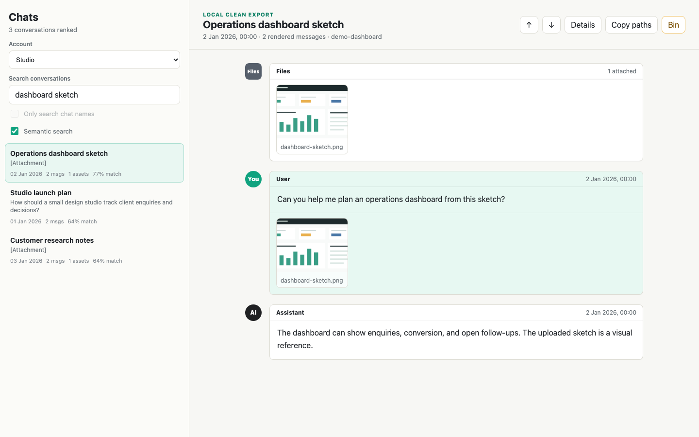

# Local ChatGPT Export & Knowledge System

Turn a ChatGPT data export into a local, searchable archive. The importer separates conversations into JSON and Markdown files, recovers file types from exported assets, builds indexes, and offers a browser or macOS viewer. Semantic search runs locally after downloading an embedding model.

This repository contains source code and a synthetic example generator. Your exports, attachments, indexes, embeddings, and logs belong in `runtime/`, which is ignored by Git.

**Mac app:** [Download the Apple Silicon release](https://github.com/zainepils/chat-export-knowledge-system/releases/tag/v0.1.0). It runs without a separate Python installation and imports export ZIPs from the app. It is not notarized; see [RELEASE.md](RELEASE.md) before opening it.



## What it does

- Imports ZIP files or extracted ChatGPT exports into separate account archives.
- Preserves per-chat JSON and generates readable Markdown transcripts.
- Restores common asset extensions and links files to chats.
- Builds title, full-text, timeline, asset, and chat manifests.
- Builds one semantic vector per chat and reuses unchanged vectors on re-import.
- Shows formatted conversations, image previews, file links, and account switching in a local viewer.
- Offers a viewer bin for chats and exclusive derived assets. Permanent deletion is opt-in.

Shared conversation export records are commonly metadata only. Semantic search ranks whole chats and may miss details deep within a long conversation.

The private agent knowledge workflow is separate from the public viewer. A generic evidence-first template is in `examples/knowledge_template/`; it provides a structure for human-reviewed claims, not automatic personal fact extraction.

## Install

Python 3.11 or newer is required. On macOS, use the `macos` extra for the native wrapper.

```bash
python3 -m venv .venv
./.venv/bin/python -m pip install -e '.[macos]'
```

## Try fictional data

```bash
./.venv/bin/python examples/make_demo_export.py runtime/demo_exports
./.venv/bin/python scripts/import_chatgpt_export.py runtime/demo_exports/studio --email studio@example.invalid --label 'Studio'
./.venv/bin/python scripts/import_chatgpt_export.py runtime/demo_exports/workshop --email workshop@example.invalid --label 'Workshop'
./.venv/bin/python scripts/serve_chat_viewer.py
```

Open the loopback URL printed by the viewer. The first semantic build downloads `BAAI/bge-small-en-v1.5`; later runs reuse the local model cache. Add `--skip-semantic` to import without embeddings.

For a synthetic demo, open `/?q=dashboard%20sketch&semantic=1&chat=demo-dashboard` after importing the Studio account.

## Import your own export

```bash
./.venv/bin/python scripts/import_chatgpt_export.py /path/to/export.zip --email you@example.com --label Personal
```

Use `--force` to replace an existing account archive. The importer builds a replacement first, then swaps it in after success. It preserves the original ZIP inside the private account archive. It does not automatically download exports from ChatGPT.

Set `CHATGPT_EXPORT_DATA_ROOT` to store runtime archives elsewhere, including a mounted drive. The viewer and importer must use the same value.
See `examples/config.example.env` for the supported environment settings; it is a template, not a file the application reads automatically.

```bash
CHATGPT_EXPORT_DATA_ROOT=/path/to/private/archive ./.venv/bin/python scripts/serve_chat_viewer.py
```

## Native macOS app

An Apple Silicon release ZIP can run without this checkout or a separate Python installation. Extract it, open `ChatGPT Export Viewer.app`, and use **Import export** to choose a ChatGPT export ZIP and account name. Imported data lives in `~/Library/Application Support/ChatGPT Export Viewer/runtime/` by default; it is not stored inside the app. The first semantic-search import needs a model download; tick **Skip semantic search** to import offline.

The release is ad-hoc signed but not notarized. macOS may ask you to approve opening an app downloaded from another machine. This build has been tested on the development Mac, not on a second Mac. See [RELEASE.md](RELEASE.md) for build and verification details.

For a development wrapper tied to this checkout:

```bash
./scripts/create_macos_app.sh
open 'dist/ChatGPT Export Viewer.app'
```

The development wrapper embeds the same local viewer and reads the configured data root. It uses this checkout's Python environment, so rebuild it after moving the checkout or changing its Python environment.

## Data layout

Each account has `raw_export/`, `source/`, `conversations/json/`, `conversations/markdown/`, `shared_conversations/`, `assets/`, `indexes/`, `semantic_search/`, and `reports/`. The account registry is `runtime/accounts/accounts.json`. Generated index paths are relative to their account archive, so the archive can be moved.

See [PRIVACY.md](PRIVACY.md) and [SECURITY.md](SECURITY.md) before importing sensitive data or sharing screenshots.
